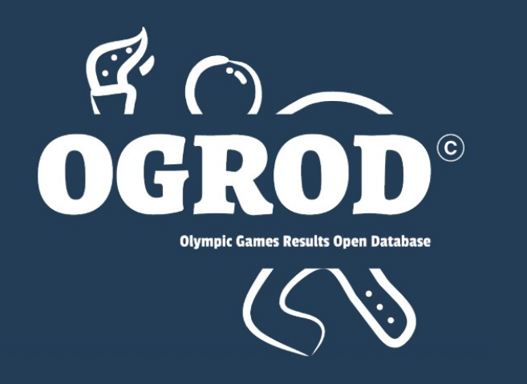

# OGROD - Olympic Games results Open Database

## Module d'insertion en base de données

## Cahier des charges

A l’occasion des futurs JO de Paris 2024, votre société a été sélectionnée pour réaliser une application permettant de naviguer aisément dans les résultats de toutes les épreuves sportives depuis la création des Jeux Olympiques modernes.
A ce stade vous ne disposez pas encore du cahier des charges avec l’expression de besoin du client mais vous pouvez d’ores-et-déjà vous occupez d’intégrer les données des résultats JO. Vous disposez à cet effet d’un fichier CSV contenant l’ensemble de ces résultats (271 000 lignes).

Vous allez devoir concevoir cette application en commençant par :

- Identifier les entités métier
- Réaliser le diagramme de classes,
- Réaliser le modèle physique de données
- Réaliser un diagramme de séquences pour un traitement décrit un peu plus loin.
- Dans ce TP il n’y a pas de développement à réaliser. Cependant cela n’est pas interdit, vous gérez votre temps comme vous le souhaitez.

Tâches à réaliser

- Analyser le fichier CSV afin d’identifier les différentes entités métier (i.e. le modèle métier).
  - Exemple : Athlete, Epreuve, etc.
- Réaliser un dossier technique rassemblant :
  - Le diagramme de classes des entités métier
  - Le modèle physique de données (i.e. les tables)
  - Le diagramme de séquences pour le traitement d’insertion des athlètes (cf ci-dessous).
- Créer un dépôt GitHub appelé projet-jo
- Créer un répertoire conception et déposez-y votre dossier technique au format PDF ou Word

- Le diagramme de séquences à réaliser :
  L’idée est de réaliser le diagramme de séquence pour le traitement suivant : ce traitement parse le fichier et met en base de données uniquement les athlètes. Comme ce traitement doit être rejouable il n’est pas question de créer les athlètes en double. 1. La classe qui lance le traitement est une classe exécutable nommée
  InsertionAthlete 2. L’extraction des athlètes du fichier doit être réalisée par une classe de service appelée AthleteService.
  Cette classe possède une méthode getAthletes qui prend en paramètre le path d’accès au fichier et retourne la liste d’athlètes. 3. Les échanges avec la base de données sont réalisés via une classe type DAO appelée AthleteDao. Cette DAO possède 3 méthodes : - Une méthode qui vérifie si un(e) athlète existe en base ou non. Cette
  méthode prend en paramètres ce qui permet d’identifier un athlète de manière unique et retourne un booléen. - Une méthode qui permet de mettre en base de données l’athlète si il/elle n’existe pas. - Une méthode qui permet de mettre à jour les informations de l’athlète si il/elle existe
